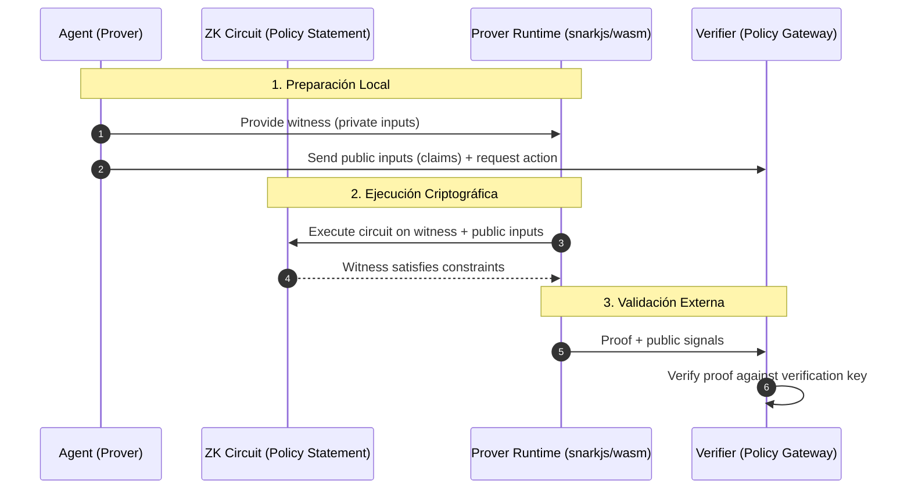

# zk-Auth: Privacy-Preserving Identity Claims for Autonomous Agent Workflows

A reference implementation of Zero-Knowledge for verifiable agentic authentication.

> How do you authorize an AI agent without exposing its data, prompts, weights or internal reasoning?

This project demonstrates a practical implementation of **Zero-Knowledge based authorization (zk-SNARK)** for autonomous agents.

The agent proves:

- It complies with policy
- It is a specific cryptographic identity
- It is executing an exact approved plan
- Without revealing sensitive inputs

⚠️ Warning: This is a research prototype. The circuits have not been audited. Do not use in production environments involving real financial assets.


# 🔐Problem Statement

Traditional agent authorization relies on:

- Tokens
- Claims
- Static RBAC roles
- Opaque delegated permissions

These approaches expose metadata and are vulnerable to:

- Replay attacks
- Statement confusion
- Policy bypass
- Agent impersonation
- Overprivileged execution

I propose a different model:

> Authorization by mathematical proof.


# 🧠Architecture Overview

Agent
- Generates private inputs
- Computes plan_hash (SHA256)
- Computes agent_id (Poseidon)
- Generates zk-SNARK proof
- Sends proof + public signals

Policy Gateway
- Verifies zk proof
-Checks agent identity whitelist
- Recomputes plan hash
- Validates nonce (anti-replay)
- Validates timestamp (time window)
- Executes action if approved



# 🏗 Project Structure

zk-auth-demo-agentid/  
│  
├── circuit/ # Circom circuits  
│ ├── zk_auth_policy_v3.circom
│ ├── zk_auth_policy_v3single.circom  #legacy single-input Poseidon variant, 
│ ├── compare_constraints.ps1         #compiles both variants and prints the constraint delta  
│ └── artifacts_v3/  
│  
├── agent/ # Agent proof generation  
│ ├── generate_input.js  
│ ├── run_proof.js
│ ├── benchmark.js                    #reproduces the performance figures reported in the paper
│ ├── benchmark_results.json          #archived output of the last benchmark run  
│ └── package.json  
│  
├── gateway/ # Policy Gateway (FastAPI)  
│ ├── main.py  
│ └── requirements.txt  
│  
└── README.md  

# 📚 Research & References


## Core Concepts

* **Groth16:** [On the Size of Pairing-based Non-interactive Arguments](https://eprint.iacr.org/2016/260.pdf) - Jens Groth.
* **Semaphore:** [Privacy-preserving identity and signaling](https://semaphore.appliedzkp.org/) - Ethereum Foundation.

## Related Work in Agentic ZK

* *Cryptographically verifiable authorization for autonomous AI agents: A falsifiable hypothesis and proof-of-concept (2026)* - [[Link](https://arxiv.org/abs/2607.21325)]
* *Zero-Knowledge Audit for Internet of Agents: Privacy-Preserving Communication Verification with Model Context Protocol (2025)* - [[Link](https://arxiv.org/abs/2512.14737)]
* *Design of an Improved Model for Authentication Using Blockchain and Zero-Knowledge Proofs (2025)* - [[Link](https://ieeexplore.ieee.org/abstract/document/11156282)]
* *Zero-Knowledge Proofs and OAuth 2.0 for Anonymity and Security in Distributed Systems  (2023)* - [[Link](https://www.e3s-conferences.org/articles/e3sconf/pdf/2023/106/e3sconf_icegc2023_00085.pdf)]
* *DIAP: A Decentralized Agent Identity Protocol with Zero-Knowledge Proofs and a Hybrid P2P Stack (2025)* - [[Link](https://arxiv.org/abs/2511.11619)]
* *Zero-Knowledge Proof (ZKP) Authentication Protocol (Github)* - [[Link](https://github.com/srinathln7/zkp-authentication?tab=readme-ov-file)]
* *Soulprint: Decentralized KYC identity protocol for AI agents (Github)* - [[Link](https://github.com/manuelariasfz/soulprint)]

## Citations
If you use this work in your research, please cite:
```bibtex
@misc{zkauthagent2026,
  author = {Mar Llambí},
  title = {ZK-Auth-Agent: Verifiable Credentials for Autonomous Agents},
  year = {2026},
  publisher = {GitHub},
  journal = {GitHub Repository},
  howpublished = {\url{[https://github.com/Imari91/zk-auth-agent-demo](https://github.com/Imari91/zk-auth-agent-demo)}}
}
```

## 📢 Presentations & Talks

[](./ROOTEDCON2026_ZKAgents.pptx)
*Presented at RootedCON Madrid (2026). Click the image to download the full slide deck.*


# 🚀 Demo Evolution

## v1 - Basic Policy Proof

Agent proves:

- clearance >= 3
- environment == production
- action == rotate_secret

No identity binding.


## v2 - Plan Binding (Statement Confusion Defense)

Agent proves:

- Policy compliance
- SHA256(operation|resource|change_id) matches proof

Prevents:
- Statement confusion
- Action swapping
- Intent manipulation


## v3 - Agent Identity (Zero Knowledge Identity)

Agent proves:

- Policy compliance
- Exact plan binding
- Identity via a randomized two-input Poseidon commitment, Poseidon(agent_secret, rho), providing hiding under a hash-based assumption rather than a bare deterministic hash

Gateway enforces:

- Identity whitelist
- Anti-replay (nonce)
- Time window validation
- zk proof verification
- Plan hash consistency

This approximates:

- Admission controllers
- Policy enforcement points
- Zero-trust agent identity


# 🔬 Cryptographic Components


- Circom 2.x
- Groth16 zk-SNARK
- bn128 curve
- SHA256 (plan binding)
- Poseidon hash (agent identity)
- snarkjs

# 📊 Reproducing Reported Metrics

Performance figures and constraint-count comparisons reported in the accompanying paper are reproducible directly from this repository.

**Performance benchmarking** (witness generation time, proof generation time, verification time, proof size, over N repeated runs):
```console
cd agent/
node benchmark.js
```

Writes `benchmark_results.json` with per-run timings, summary statistics (mean ± standard deviation), and circuit metadata.

**Constraint-count comparison** (randomized vs. deterministic identity commitment):
```console
cd circuit/
.\compare_constraints.ps1
```

Compiles both `zk_auth_policy_v3.circom` (current, randomized) and `zk_auth_policy_v3single.circom` (legacy, deterministic) into isolated output folders and prints the resulting constraint/wire/input delta, without modifying `artifacts_v3/` or the existing trusted setup.

# 🧪 Running the Demo

## 1. Compile Circuit

```console
  circom zk_auth_policy_v3.circom --r1cs --wasm --sym -o artifacts_v3 -l node_modules
```

## 2. Setup zk keys

Execute each line individually to ensure files are correctly compiled:

```console
snarkjs groth16 setup artifacts_v3/zk_auth_policy_v3.r1cs pot12_final.ptau artifacts_v3/zk_auth_0000.zkey
snarkjs zkey contribute artifacts_v3/zk_auth_0000.zkey artifacts_v3/zk_auth_final.zkey
snarkjs zkey export verificationkey artifacts_v3/zk_auth_final.zkey artifacts_v3/verification_key.json
```

## 3.Generate Proof

Inside `agent/`:

```console
node run_proof.js
```

## 4. Run Gateway

Inside `gateway/`:
```console
uvicorn main:app --reload
```

## 5. Execute Request

```console
curl.exe -X POST "http://127.0.0.1:8000/api/execute
" -H "Content-Type: application/json" --data-binary "@request.json"
```


